# Van Gogh Style Transfer Using ComfyUI

This project implements a ComfyUI workflow for transforming input images into Van Gogh style paintings using Stable Diffusion and ControlNet. The workflow uses multiple ControlNet models and a depth map for enhanced control and detail preservation.

## Table of Contents
1. [Installation](#installation)
2. [Usage](#usage)
3. [Workflow Overview](#workflow-overview)
4. [Sample Results](#sample-results)
5. [Troubleshooting](#troubleshooting)

## Installation

### 1. Install ComfyUI

1. Clone the ComfyUI repository:
   ```
   git clone https://github.com/comfyanonymous/ComfyUI.git
   ```

2. Navigate to the ComfyUI directory:
   ```
   cd ComfyUI
   ```

3. Install the required Python packages:
   ```
   pip install -r requirements.txt
   ```

### 2. Install ComfyUI Manager

1. Navigate to the custom_nodes directory:
   ```
   cd custom_nodes
   ```

2. Clone the ComfyUI Manager repository:
   ```
   git clone https://github.com/ltdrdata/ComfyUI-Manager.git
   ```

### 3. Launch ComfyUI

1. Return to the ComfyUI root directory:
   ```
   cd ..
   ```

2. Start ComfyUI:
   ```
   python main.py
   ```

3. Open your web browser and go to `http://localhost:8188`

### 4. Install Required Nodes and Models

1. In the ComfyUI interface, click on the "Manager" tab.
2. Search for and install the following custom nodes:
   - CR Multi-ControlNet Stack
   - CR Apply Multi-ControlNet
   - CR String To Number
   - CR Text
   - DepthAnything_V2
   - AnyLineArtPreprocessor_aux
   - KSampler Adv. (Efficient)

   Or alternatively click on "Install Missing Custom Nodes" in ComfyUI Manager Menu.

   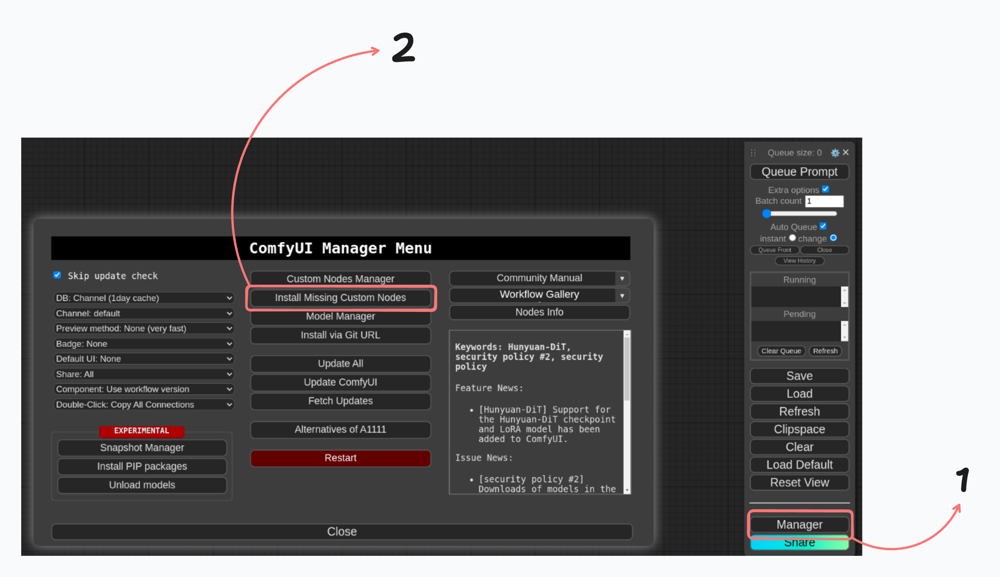
   

3. Install the following models:
   - v1-5-pruned-emaonly.ckpt (Stable Diffusion v1.5)
   - control_v11f1p_sd15_depth_fp16.safetensors
   - control_v11u_sd15_tile_fp16.safetensors
   - control_v11p_sd15_canny_fp16.safetensors (optional)
   - control_v11p_sd15_lineart_fp16.safetensors
   - *depth_anything_v2_vitl_fp32.safetensors* (**This model will be automatically downloaded once Queue Prompt is clicked.**)

## Usage

1. Import the provided workflow JSON file into ComfyUI.

    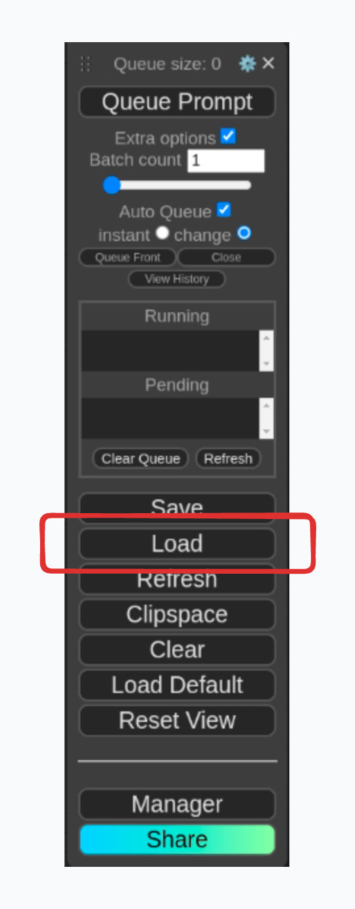

2. Load your input image using the "LoadImage" node.

    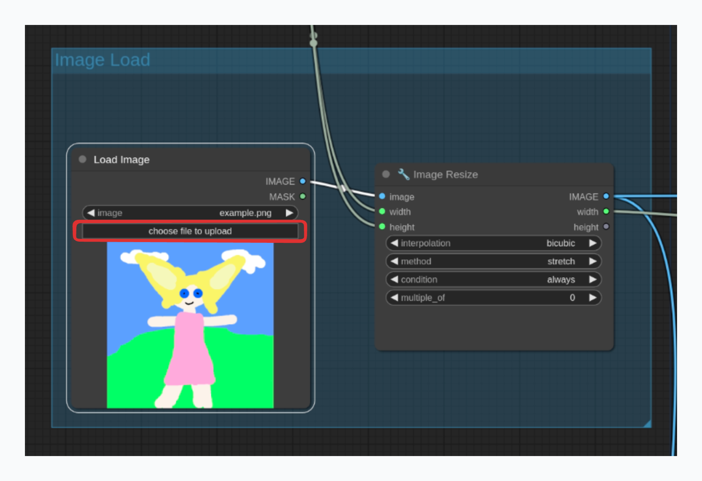

3. Adjust the resolution in the "CR Text" node if needed.

    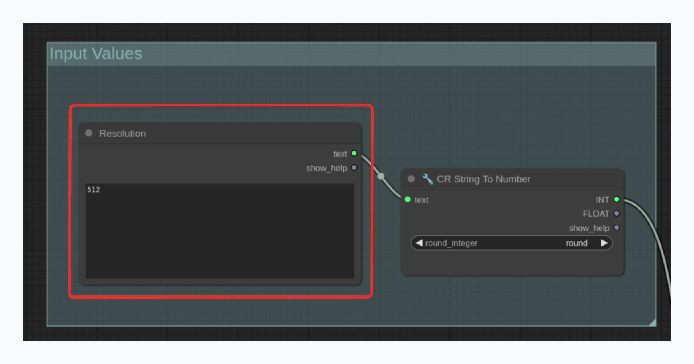

4. Modify the positive and negative prompts in the "CLIPTextEncode" nodes to fine-tune the style transfer.

    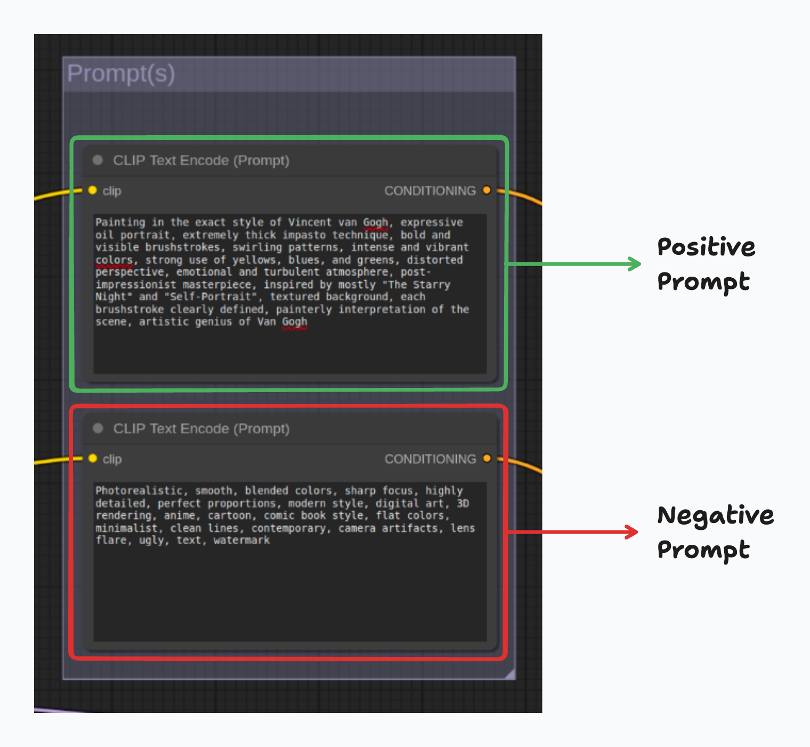

5. Click "Queue Prompt" to generate the Van Gogh style image.

    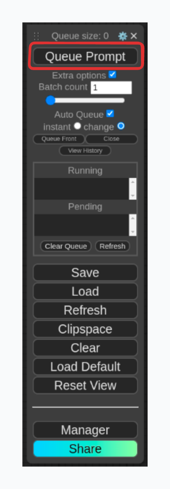

## Workflow Overview

The workflow consists of the following main components:

1. Image Loading and Preprocessing
2. Depth Map Generation
3. ControlNet Processing (Tile, Canny, Lineart)
4. Stable Diffusion Model with ControlNet Conditioning
5. VAE Encoding and Decoding
6. Advanced Sampling

## Sample Results

Here are some sample results from the Van Gogh style transfer workflow:

1. Original Image | Van Gogh Style


    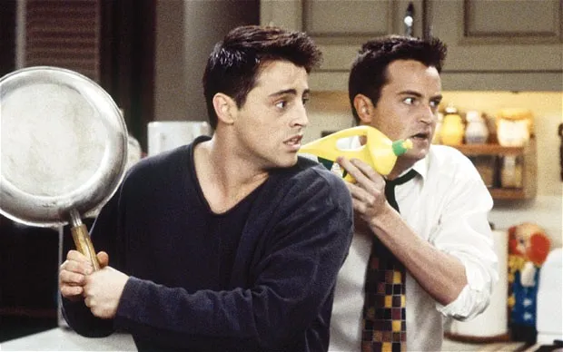
    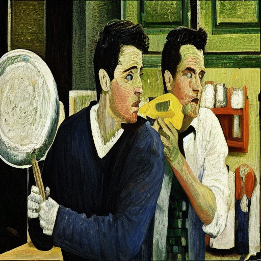

2. Original Image | Van Gogh Style


    
    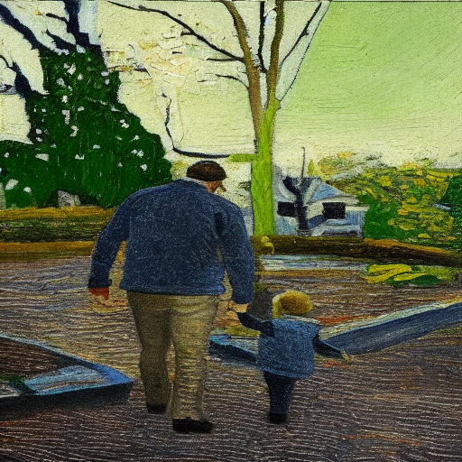

3. Original Image | Van Gogh Style


    
    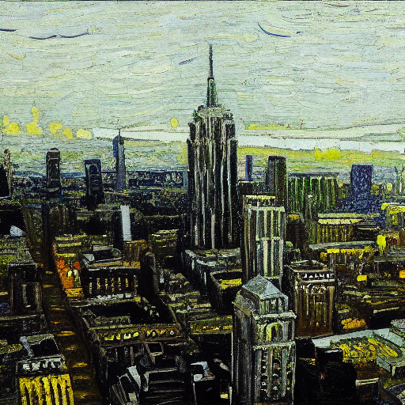

4. Original Image | Van Gogh Style


    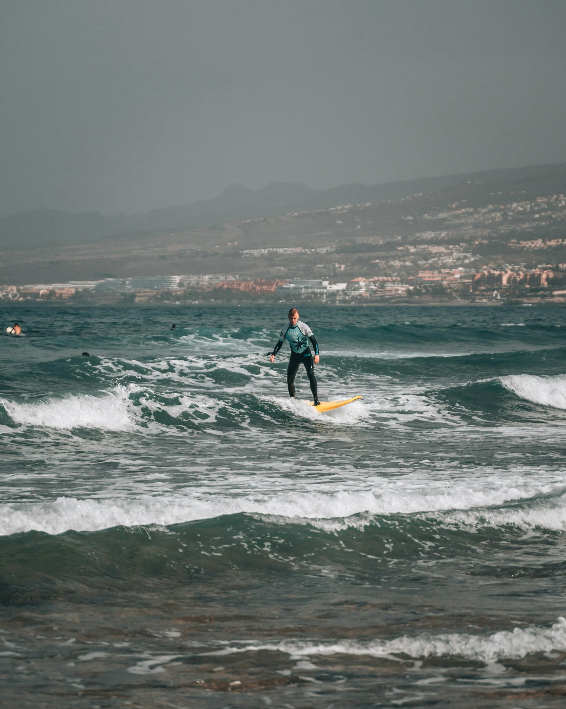
    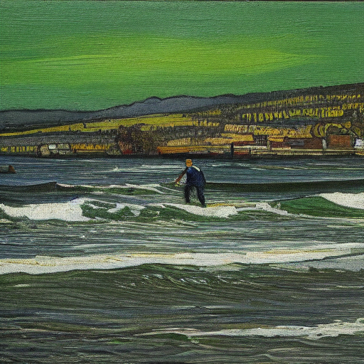

5. Original Image | Van Gogh Style


    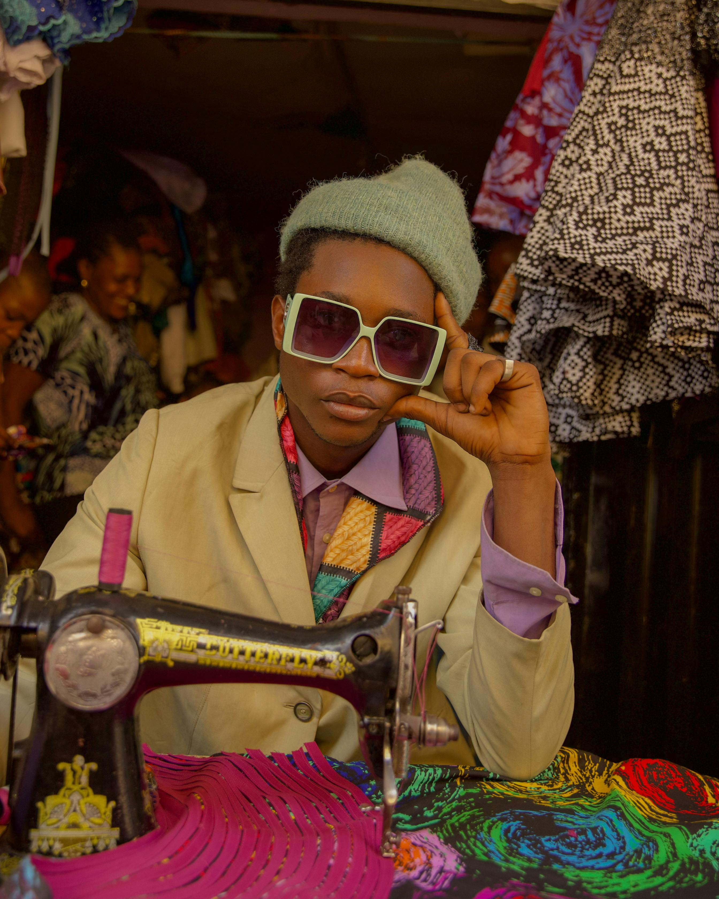
    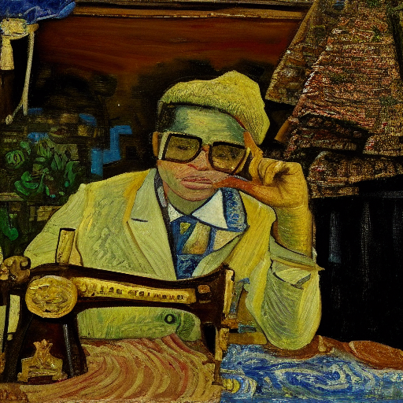

6. Original Image | Van Gogh Style


    
    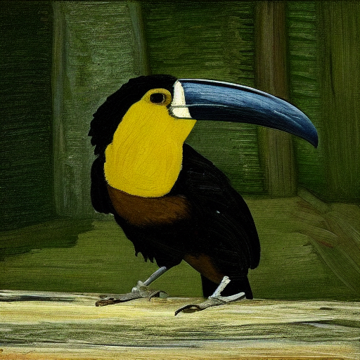

7. Original Image | Van Gogh Style


    
    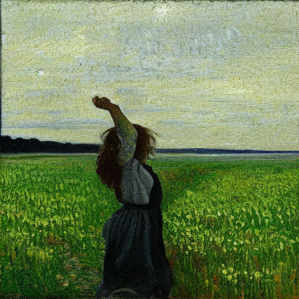

8. Original Image | Van Gogh Style

    
    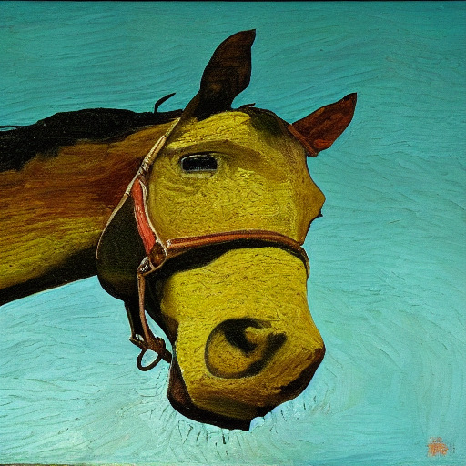

9. Original Image | Van Gogh Style


    
    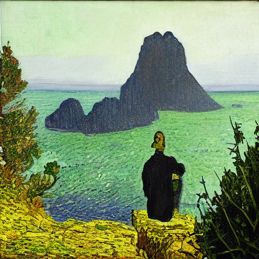
    
## Troubleshooting

1. **Missing Nodes**: If you encounter missing nodes, make sure you've installed all required custom nodes using the ComfyUI Manager.

2. **Model Loading Errors**: Ensure all required models are downloaded and placed in the correct directory (usually `models/checkpoints` for Stable Diffusion models and `models/controlnet` for ControlNet models).

3. **CUDA Out of Memory**: If you encounter CUDA out of memory errors, try reducing the resolution in the "CR Text" node or use a GPU with more VRAM.

4. **Unexpected Results**: Fine-tune the prompts in the "CLIPTextEncode" nodes and adjust the ControlNet weights in the "CR Multi-ControlNet Stack" nodes to achieve desired results.

5. **Performance**: Workflow was designed to use multiple ControlNets. Based on your hardware, you can activate and deactive ControlNets. Workflow does not use the Canny Edge ControlNet but if needed it can be activated. It was placed during experimenting and was decided to leave it as an option.
